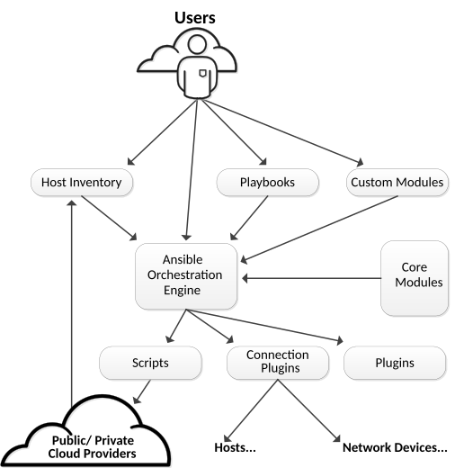

:noaudio:

== Topics

* Overview
* Architecture
* Use Cases
* Deployments
* Software That Uses Ansible
* Orchestration Methods
* Connection Plug-ins
* Modules
* Ad-Hoc Commands

ifdef::showscript[]

Transcript:

In this module, you learn the following:

* Ansible is an agentless configuration management tool built on Python.
* Ansible is installed on the control node and keeps its configuration files there.
* Ansible copies modules from the control node to the managed hosts, where it executes them in the order specified in the playbook.
* Ansible is ideal for deploying applications in parallel on Red Hat Enterprise Linux, JBoss, and OpenShift Enterprise, and it can assist with Red Hat Satellite system management.
* Ansible can orchestrate zero-downtime rollover application upgrades.
* Native SSH is Ansible's default connection plug-in, but the Paramiko plug-in provides efficient SSH communications with Red Hat Enterprise Linux 5 systems.
* Ansible ships with a number of modules (called the 'module library') that can be executed directly on remote hosts or through Playbooks.
* Ad-hoc commands in Ansible allow you to execute simple tasks at the command line against one or all of your hosts

endif::showscript[]

== Overview

* *Ansible:* Open source configuration management and orchestration utility
* Automates and standardizes configuration of remote hosts and virtual machines
* Coordinates launch and shutdown of multitiered applications
** Performs rolling updates of multiple systems with zero downtime
* Originally written by Michael DeHaan
** Creator of Cobbler provisioning application
* System administrators find it simple to use
* Developers can easily learn
** Built on Python
* Supported by DevOps tools such as Vagrant and Jenkins

ifdef::showscript[]

Transcript:

Ansible is an open source configuration management and orchestration utility. It can automate and standardize the configuration of remote hosts and virtual machines. Its orchestration functionality allows Ansible to coordinate the launch and graceful shutdown of multitiered applications. Because of this, Ansible can perform rolling updates of multiple systems with zero downtime.

Ansible was originally written by Michael DeHaan, the creator of the Cobbler provisioning application. Ansible has been widely adopted because system administrators find it simple to use and developers can ease into it because it is built on Python. Ansible is supported by DevOps tools such as Vagrant and Jenkins.

endif::showscript[]

== Overview

.Ansible Limitations

* Cannot audit changes made by other users on system
** Example: Cannot determine who made change to a file
* Does not perform initial minimal installation of system
** Start with minimal installation via Kickstart or base cloud starter image
** Use Ansible to add packages and for configuration

* Does not monitor configuration drift
** Can remediate it
* Does not track changes made to files on system
** Does not track which user or process made changes
** To track changes, use version control system or Linux Auditing System

ifdef::showscript[]

Transcript:

There are several things that Ansible cannot do. Ansible cannot audit changes made locally by other users on a system--for example, to determine who made a change to a file.

Ansible can add packages to an installation, but it does not perform the initial minimal installation of the system. A system can start with a minimal installation, either via Kickstart or a base cloud starter image, then use Ansible for further configuration.

Although Ansible can remediate configuration drift, it does not monitor for it.

Ansible does not track the changes made to files on the system, nor does it track the users or processes that made those changes. These types of changes are best tracked with a version control system or the Linux Auditing System.

endif::showscript[]

== Architecture

* Two types of machines in Ansible architecture: _control node_ and _managed hosts_
** Ansible software installed and components maintained on control node
** Managed hosts listed in _host inventory_
*** Text file on control node with managed host names or IP addresses

* System administrators log in to control node and launch Ansible
** Specify playbook 
** Specify target host to manage: single system, group of hosts, or wild card

* SSH used as network transport to communicate with managed hosts
** Modules referenced in playbook copied to managed hosts
** Modules execute in order with arguments specified in playbook

* Core modules perform most system administration tasks
** Users can write _custom modules_

ifdef::showscript[]

Transcript:

There are two types of machines in the Ansible architecture: the _control node_ and _managed hosts_. Ansible software is installed on the control node, and all of its components are maintained on it. The managed hosts are listed in a _host inventory_, a text file on the control node that includes a list of managed host names or IP addresses.

System administrators log in to the control mode and launch Ansible, providing it with a playbook and a target host to manage. Instead of a single system to process, you can specify a group of hosts or a wild card. Ansible uses SSH as a network transport to communicate with the managed hosts. The modules referenced in the playbook are copied to the managed hosts and then executed, in order, with the arguments specified in the playbook. Ansible users can write their own _custom modules_, but the core modules that come with Ansible can perform most system administration tasks.

endif::showscript[]

== Architecture

ifdef::showscript[]

Transcript:

Here you see a representation of the Ansible architecture.

endif::showscript[]

== Architecture

.Control Node Components
[cols="1,4",caption=""]
|====
|Component
|Description
|Ansible configuration
a|* Defines how Ansible behaves. Settings include:
** Remote user for command execution
** Passwords for executing remote commands with `sudo`
* To override default values, use environment variables or values defined in configuration files
|Host inventory
a|* Defines configuration groups to which hosts belong
* Defines how Ansible communicates with managed host
* Defines host and group variable values
|Core modules
a|* Programs copied to managed hosts to perform work for Ansible
* Over 400 core modules built in
|Custom modules
a|* Extend functionality
* Typically written in Python
** Alternative: Any interpreted programming language
* Add custom modules to Ansible library
|Playbooks
a|* Files written in YAML syntax
* Define modules, with arguments, to apply to managed nodes
* Declare tasks that need to be performed
|Connection plug-ins
a|* Enable communication with remote hosts and cloud
* Include native SSH (default), paramiko SSH, and local
* Paramiko: Python implementation of OpenSSH for Red Hat Enterprise Linux 6
** Provides `ControlPersist` performance setting required by Ansible
|Plug-ins
a|* Extend Ansible's functionality
* Examples: Email notifications and logging
|====

ifdef::showscript[]

Transcript:

This table lists the Ansible components that are maintained on the control node.

Ansible has configuration settings that define how it behaves. These settings include such things as the remote user to use to execute commands, and the passwords to provide when executing remote commands with `sudo`. Default configuration values can be overridden by environment variables or values defined in configuration files.

The Ansible host inventory defines the configuration to which groups hosts belong. The inventory can define how Ansible communicates with a managed host. It also defines host and group variable values.

Modules are the programs that are copied to the managed hosts to perform the work for Ansible. Ansible comes with over 400 core modules built in.

Users can extend Ansible's functionality by writing their own modules and adding them to the Ansible library. Modules are typically written in Python but can be written in any interpreted programming language, such as shell, Ruby, or Python.

Ansible Playbooks are files written in YAML syntax that define the modules, with arguments, to apply to managed nodes. They declare the tasks that
need to be performed.

Connection plug-ins enable communication with remote hosts and cloud. These include native SSH (the default), paramiko SSH, and local. Paramiko is a Python implementation of OpenSSH for Red Hat Enterprise Linux 6 that provides the `ControlPersist` performance setting that Ansible requires.

Additional plug-ins extend Ansible's functionality. Examples include email notifications and logging.

endif::showscript[]

== Architecture

.Control Node Role

* System administrators log in and initiate Ansible operations from control node
* Ansible software installed and configuration files maintained on control node

* Other names for control node: _Ansible host_ and _control machine_

ifdef::showscript[]

Transcript:

System administrators log in and initiate all Ansible operations from the control node. Ansible software is installed on the control node. Ansible configuration files are also maintained on the control node. Other names for the control node include _Ansible host_ and _control machine_, but this course consistently uses the term _control node_ for the machine that serves this role.

endif::showscript[]

== Architecture

.Control Node Requirements

* Must have Python 2.6 or 2.7 installed
** Includes Linux, OS X, any BSD-based UNIX system
** Windows not currently supported for control node
** On Red Hat Enterprise Linux 6 or 7, `ansible` package and dependencies must be installed

ifdef::showscript[]

Transcript:

A machine acting as a control node must have Python 2.6 or 2.7 installed. This includes Linux, OS X, and any BSD-based UNIX system. Windows is not supported for the control node at this time. Ansible runs on Red Hat Enterprise Linux 6 or 7, but the `ansible` package and its dependencies must be installed. 

endif::showscript[]

== Architecture

.Managed Host Role

* Ansible does the following on managed host systems: 
** Logs in
** Installs modules
** Executes remote commands for configuration
* Other names for managed host: _managed node_ and _remote node_

ifdef::showscript[]

Transcript:

A managed host is a system that Ansible logs in to, installs modules in, and executes remote commands to perform cofiguration tasks. Other names for a managed host include _managed node_ and _remote node_. This course consistently uses the term _managed host_ for machines managed by Ansible.

endif::showscript[]

== Architecture

.Managed Host Requirements

* SSH must be installed and configured
** Allows incoming connections and communication with managed hosts
* Python 2.4 or later 
** Lets you use Ansible to manage Red Hat Enterprise Linux 5, 6, and 7 hosts

* `python-simplejson` package must be installed on Red Hat Enterprise Linux 5 managed hosts
** Not required on Red Hat Enterprise Linux 6 and 7 managed hosts
** Python 2.5 and newer versions provide functionality by default

[NOTE]
Modules can have their own unique software requirements. Playbooks must be written so that prerequisite software is installed before calling a module that uses it.

ifdef::showscript[]

Transcript:

Ansible uses SSH to communicate with managed hosts, so SSH must be installed and configured to allow incoming connections. Python 2.4 or later is also a requirement to run Ansible, so Ansible can be used to manage Red Hat Enterprise Linux 5, 6, and 7 hosts.

The `python-simplejson` package must also be installed on Red Hat Enterprise Linux 5 managed hosts. It is not required on Red Hat Enterprise Linux 6 and 7 managed hosts, since Python 2.5 and newer versions provide its functionality by default.

Note that modules can have their own, unique software requirements. Playbooks must be written so that prerequisite software is installed before calling a module that uses it.

endif::showscript[]

== Use Cases

* Configuration management
** Deploy and manipulate remote host's configuration files
** Use static files or create files on fly using templates

* Multi-node deployment tool
** Use playbooks to define applications installed and configured on remote machines
** Apply playbook to multiple machines, building them in consistent manner
** Orchestrate multi-node applications with Ansible rules

* Remote task execution
** Example: Specify ad hoc commands on command line
*** Causes Ansible to execute commands on remote hosts

ifdef::showscript[]

Transcript:

When administrators think of Ansible, the first thing that comes to mind is configuration management. Ansible can deploy and manipulate the configuration files of a remote host. The files can be static or created on the fly, using templates.

Ansible can also be used as a multi-node deployment tool. Playbooks can define the applications that are installed and configured on remote machines. A playbook can be applied to multiple machines, building them all in a consistent manner. Also, multi-node applications can be orchestrated by Ansible's rules.

Ansible can also perform remote task execution. You can demonstrate this by specifying ad hoc commands on the command line, which causes Ansible to execute the commands on remote hosts.

endif::showscript[]

== Deployments

* Ansible strength: Simplifies software configuration of servers

* When Ansible accesses managed hosts, it can discover version of Red Hat Enterprise Linux running on remote server
* Ansible determines if host is properly entitled by comparing installed applications and applied software subscriptions

* Ansible Playbooks can consistently build development, test, and production servers
** Kickstart can get bare-metal servers running 
** Ansible builds them further
** Provision servers to corporate baseline standard or specific role within datacenter

ifdef::showscript[]

Transcript:

One of Ansible's strengths is in how it simplifies the configuration of software on servers.

When Ansible accesses managed hosts, it can discover the version of Red Hat Enterprise Linux running on the remote server. The installed applications and applied software subscriptions can be compared to determine if the host is properly entitled. Ansible Playbooks can be used to consistently build development, test, and production servers. Kickstart can get bare-metal servers running and then let Ansible take over and build them further. They can be provisioned to a corporate baseline standard, or they can be built for a specific role within the datacenter.

endif::showscript[]

== Deployments

.JBoss

* Ansible can discover JBoss versions and reconcile subscriptions
* Ansible supports managed hosts running Windows
** JBoss products can be deployed consistently, regardless of target machine operating systems
* Ansible can also deploy and manage JBoss applications
** All JBoss configurations are centrally stored on Ansible control node

ifdef::showscript[]

Transcript:

Similarly, Ansible can discover JBoss versions and reconcile subscriptions. Ansible also supports managed hosts running Windows, so JBoss products can be deployed consistently, regardless of the target machines' operating systems. Ansible also can deploy and manage JBoss applications, because all of the JBoss configurations are centrally stored on the Ansible control node.

endif::showscript[]

== Deployments

.Red Hat OpenShift

* Ansible can manage software development life cycle for applications deployed into OpenShift
* OpenShift Enterprise 3.1 provides:
** Ansible software for Red Hat Enterprise Linux
** Playbooks for provisioning and managing applications

.Red Hat Satellite

* Ansible can supplement functionality provided by Red Hat Satellite
** Deploy Satellite agents to existing servers in datacenter
** Discover and manage software subscriptions on Red Hat Satellite clients
** Perform post-install configuration of hosts provisioned by Red Hat Satellite

ifdef::showscript[]

Transcript:

You can use Ansible to manage the software development life cycle for applications deployed into OpenShift. In fact, OpenShift Enterprise 3.1 provides Ansible software for Red Hat Enterprise Linux and playbooks that can be used to provision and manage applications.

You can also use Ansible to supplement the functionality provided by Red Hat Satellite. Ansible can deploy Satellite agents to existing servers in a datacenter. Ansible can also discover and manage software subscriptions on Red Hat Satellite clients. Finally, Ansible can perform post-install configuration of hosts provisioned by Red Hat Satellite.

endif::showscript[]

== Orchestration Methods

* Ansible commonly used to finish provisioning application servers
* Example: Write playbook to perform these steps on newly installed base system:
+
. Configure software repositories
. Install application
. Tune configuration files
. (Optional) Download content from version control system
. Open required service ports in firewall
. Start relevant services
. Test application and confirm it is functioning

ifdef::showscript[]

Transcript:

Ansible is commonly used to finish provisioning application servers. For example, you can write a playbook to perform the steps shown here on a newly installed base system:

. Configure software repositories.
. Install the application.
. Tune configuration files.
. (Optional) Download content from a version control system.
. Open required service ports in the firewall.
. Start relevant services.
. Test the application and confirm that it is functioning.

endif::showscript[]

== Connection Plug-ins

* *Connection plug-ins:* Allow Ansible to communicate with managed hosts and cloud providers
* Preferred connection plug-in for newer versions of Ansible is native SSH plug-in, `ssh`
** Default connection method used by Ansible
*** If OpenSSH on control node supports `ControlPersist` option
* Ansible supports passwords for SSH authentication
** Most common practice: Use SSH user keys to access managed hosts

ifdef::showscript[]

Transcript:

Connection plug-ins allow Ansible to communicate with managed hosts and cloud providers. The preferred connection plug-in for newer versions of Ansible is the native SSH plug-in, `ssh`. This is the default connection method that Ansible uses when OpenSSH on the control node supports the `ControlPersist` option. Although Ansible can be configured to use passwords for SSH authentication, the most common practice is to use SSH user keys to get access to managed hosts.

endif::showscript[]

== Connection Plug-ins

.`local`

* `local`: Another connection plug-in for Linux applications
* Use to manage Ansible control node locally, without SSH
* Common uses:
** When writing playbooks that interface with cloud services or other API
** When Ansible is invoked locally by `cron` job

ifdef::showscript[]

Transcript:

Another connection plug-in used for Linux applications is `local`. This plug-in can be used to manage the Ansible control node locally, without needing to use SSH. 

This connection method is typically used when writing Ansible Playbooks that interface with cloud services or some other API. It can also be used when Ansible is invoked locally by a `cron` job.

endif::showscript[]

== Connection Plug-ins

.`paramiko` and `ControlPersist`

* `paramiko`: Connection plug-in used on Red Hat Enterprise Linux 6 machines

** Paramiko SSH is Python-based OpenSSH implementation that implements persistent SSH connections
** Connection solution for older systems using versions of OpenSSH that do not implement `ControlPersist`
* `ControlPersist` allows for persistent SSH connections
** Improves Ansible performance 
** Eliminates SSH connection overhead when multiple SSH commands execute in succession

ifdef::showscript[]

Transcript:

The `paramiko` Ansible connection plug-in is used on Red Hat Enterprise Linux 6 machines.

Paramiko SSH is a Python-based OpenSSH implementation that implements persistent SSH connections. It was a connection solution for older systems using versions of OpenSSH that did not implement the `ControlPersist` connection setting. The `ControlPersist` connection setting allows for persistent SSH connections, a feature that improves Ansible performance by eliminating SSH connection overhead when multiple SSH commands are executed in succession.

endif::showscript[]

== Connection Plug-ins

.`winrm` and `docker`

* `winrm`: Allows Microsoft Windows machines to be managed hosts
** `pywinrm` Python module must be installed on Linux control node to support `winrm`

* `docker`: Allows Ansible to treat Docker containers as managed hosts without using SSH
** Introduced in Ansible 2

ifdef::showscript[]

Transcript:

The `winrm` Ansible connection plug-in allows Microsoft Windows machines to be managed hosts. The `pywinrm` Python module must be installed on the Linux control node to support this connection plug-in.

Ansible 2 introduced the `docker` connection plug-in. This plug-in allows Ansible to treat Docker containers as managed hosts without using SSH.

endif::showscript[]

== Configuring Ansible

.Configuration file

* Settings in Ansible are adjustable via a configuration file (ansible.cfg).
* The default configuration file (/etc/ansible/ansible.cfg) sufficient for most users, but there may be reasons you would want to change them. 

.Environmental configuration

* Ansible also allows configuration of settings using environment variables.
* If these environment variables are set, they will override any setting loaded from the configuration file.

.Command line options
* Not all configuration options are present in the command line, just the ones deemed most useful or common.
* Settings in the command line will override those passed through the configuration file and the environment.

----

ifdef::showscript[]

Transcript:

For configuring Ansible we have three different ways.

Configuration file
Settings in Ansible are adjustable via a configuration file (ansible.cfg).
The default configuration file (/etc/ansible/ansible.cfg) sufficient for most users, but there may be reasons you would want to change them. 

Environmental configuration
Ansible also allows configuration of settings using environment variables.
If these environment variables are set, they will override any setting loaded from the configuration file.

Command line options
Not all configuration options are present in the command line, just the ones deemed most useful or common.
Settings in the command line will override those passed through the configuration file and the environment.

endif::showscript[]

== Configuring Ansible

.Ansible Configuration Settings

* The `ansible-config` utility allows users to see all the configuration settings available, their defaults, how to set them and where their current value comes from.

* Changes can be made and used in a configuration file which will be searched for in the following order:

** `ANSIBLE_CONFIG` (environment variable if set)
** `ansible.cfg` (in the current directory)
** `~/.ansible.cfg` (in the home directory)
** `/etc/ansible/ansible.cfg`

* Ansible will process the above list and use the first file found, all others are ignored.

ifdef::showscript[]

Transcript:

The `ansible-config` utility allows users to see all the configuration settings available, their defaults, how to set them and where their current value comes from.

* Changes can be made and used in a configuration file which will be searched for in the following order:

** `ANSIBLE_CONFIG` (environment variable if set)
** `ansible.cfg` (in the current directory)
** `~/.ansible.cfg` (in the home directory)
** `/etc/ansible/ansible.cfg`

* Ansible will process the above list and use the first file found, all others are ignored.

endif::showscript[]

== Prerequisites

.Control Node

* Ansible uses agentless architecture
** Differs from other configuration management utilities like Puppet, Chef
* Software installs on control node
** Few steps
** Only requirement: Python version 2.6 or later
** To check installed Python version:
+
----
[root@controlnode ~]# yum list python
Loaded plugins: langpacks, search-disabled-repos
Installed Packages
python.x86_64	2.7.5-34.el7	installed
----

* Ansible currently not included in Red Hat Enterprise Linux
* For installation instructions and other information: link:https://www.ansible.com/get-started["https://www.ansible.com/get-started^"]

ifdef::showscript[]

Transcript:

Unlike other configuration management utilities, such as Puppet and Chef, Ansible uses an agentless architecture. Due to the nature of this architecture, the installation of Ansible software takes place only on the control node. This installation involves relatively few steps and has very minimal requirements.

Ansible installation on the control node requires only that version 2.6 or later of Python software be installed. To see whether the appropriate version of Python is installed on a Red Hat Enterprise Linux system, use the `yum` command as shown here.

Currently, Ansible is not included directly in Red Hat Enterprise Linux. Official instructions on how to obtain, install, and update Ansible for Red Hat Enterprise Linux, as well as for other operating systems and Linux distributions, are available on the Ansible website at https://www.ansible.com/get-started.

endif::showscript[]

== Prerequisites

.Managed Hosts

* No special Ansible agent needed
* Require Python 2.4 or later
* Python prior to 2.5, also requires `python-simplejson`

* Control node communicates with managed hosts over network
** Multiple options available
** SSH connection used by default
* Ansible normally connects to managed hosts using same username running Ansible on control node

* SSH sessions require authentication at initiation of each connection
** Password authentication for each connection becomes unwieldy as number of managed hosts increases
** Key-based authentication preferable in enterprise environments

ifdef::showscript[]

Transcript:

Managed hosts do not need to have any special Ansible agent installed. They do need to have Python 2.4 or later installed. If the version of Python that is installed on the managed host is older than Python 2.5, then it must also have the `python-simplejson` package installed.

The Ansible control node communicates with managed hosts over the network. Multiple options are available, with SSH as the default. Ansible normally connects to the managed host by using the same username as the one running Ansible on the control node.

To ensure security, SSH sessions require authentication at the initiation of each connection. Relying on password authentication for each connection to each managed host quickly becomes unwieldy as the number of managed hosts increases. Therefore, in enterprise environments, key-based authentication is the preferred option.

endif::showscript[]

== Prerequisites

.SSH Key-Based Authentication

* To authenticate `ssh` logins without password, use public key authentication
* `ssh` lets users authenticate using private/public key scheme
** Two keys generated: private and public

* Private key file used as authentication credential
** Must be kept secret and secure
* Public key copied to systems user wants to log in to
** Used to verify private key
** Does not need to be secret

* SSH server with public key issues challenge
** System with private key answers
** Possession of private key used to complete authentication

ifdef::showscript[]

Transcript:

Users can authenticate `ssh` logins without a password by using public key authentication. `ssh` allows users to authenticate using a private/public key scheme. This means that two keys are generated: a private key and a public key.

The private key file is used as the authentication credential. Like a password, it must be kept secret and secure. The public key is copied to systems the user wants to log in to, and is used to verify the private key. The public key does not need to be secret.

An SSH server with the public key issues a challenge that can be answered only by a system holding the private key. Possession of the private key is used to complete the authentication.

endif::showscript[]

== Prerequisites

.`ssh-keygen`

* To generate keys, use `ssh-keygen`
** Private key: `~/.ssh/id_rsa`
** Public key: `~/.ssh/id_rsa.pub`

* Default: SSH keys stored in `.ssh/` directory of user's home directory
* File permissions on private key allow:
** Read/write access to user who owns file
** Octal `0600`
* File permissions on public key allow:
** All system users read access
** Only file owner write access
** Octal `0644`

ifdef::showscript[]

Transcript:

To perform key generation, use the `ssh-keygen` command. This generates the private key and the public key.

After the SSH keys are generated, they are stored by default in the `.ssh/` subdirectory of the user's home directory. The file permissions on the private key allow read and write access only to the user who owns the file--that is, octal `0600`. The file permissions on the public key allow all users on the system to read the file but allow only the user who owns the file to have write access--that is, octal `0644`.

== Prerequisites

.`ssh-copy-id`

* Before using key-based authentication, need to copy public key to destination system
* To do this, use `ssh-copy-id`:
+
----
[student@controlnode ~]$ ssh-copy-id student@managedhost
----

* After copying key, use key-based authentication to authenticate SSH connections to host

ifdef::showscript[]

Transcript:

Before you can use key-based authentication, the public key needs to be copied to the destination system. To do this, use `ssh-copy-id` as shown here.

After the public key has been copied to the destination host, future SSH connections to the host can be authenticated using key-based authentication.

endif::showscript[]

== Modules

* Use modules to perform operations on managed hosts
** Ready-to-use tools for specific tasks
** Run from command line or use in playbooks
** Copied to and run from managed host

* Over 200 prepackaged modules
** Let you perform wide range of tasks
** Examples: Cloud, user, package, service management

ifdef::showscript[]

Transcript:

Modules are programs that Ansible uses to perform operations on managed hosts. They are ready-to-use tools designed to perform specific tasks. You can run modules from the `ansible` command line or use them in playbooks to execute tasks. When run, modules are copied to the managed host and executed there.

Ansible comes packaged with over 200 modules available for use. These prepackaged modules let you perform a wide range of tasks, such as cloud, user, package, and service management.

endif::showscript[]

== Modules

.Module Types
[cols="1,4",caption=""]
|====
|Module Type
|Description
|Core modules
a|* Included with Ansible
* Written and maintained by Ansible Engineering Team
* Integral to basic foundations of Ansible distribution
* Used for common tasks
* Always available
|Network Modules
a|* Currently included with Ansible
* Written and maintained by Ansible Network Team
* Categorized as Certified or Community, not maintained by Ansible
|Certified Modules
a|* Part of a future planned program currently in development
|Community Modules
a|* Included as a convenience
* Submmitted and maintained by Ansible Community
* Modules are not maintained by Ansible
* Included as a convenience
|====

ifdef::showscript[]

Transcript:

There are four types of Ansible modules:

* _Core_  Core modules are maintained by the Ansible Engineering Team. These modules are integral to the basic foundations of the Ansible distribution.

* _Network_ Network modules are maintained by the Ansible Network Team. Please note there are additional networking modules that are categorized as Certified or Community not maintained by Ansible.

* _Certified_ Certified modules are part of a future planned program currently in development.

* _Community_ Community modules are submitted and maintained by the Ansible community. These modules are not maintained by Ansible, and are included as a convenience.

The modules are hosted on GitHub in a subdirectory of the Ansible repo. 

endif::showscript[]

== Modules

.Use of Categories: Documentation and Organization

* Module documentation indexed by category on Ansible documentation website
** Helps in searching for module for specific task
* Module storage on Ansible control node organized by categories
** Modules installed under `/usr/lib/python2.7/site-packages/ansible/modules`
** Core and extra modules housed under separate directories
** Modules within directories organized into subdirectories by category

ifdef::showscript[]

Transcript:

On the Ansible documentation website, module documentation is indexed by category. This helps administrators in searching for a module that suits their specific task. On the Ansible control node, the same category list is used to organize module storage.

Modules are installed under the `/usr/lib/python2.7/site-packages/ansible/modules` directory on the Ansible control node. Core and extra modules are housed under separate directories. Modules within the two directories are organized into subdirectories by category.

endif::showscript[]

== Modules

.Module Categories
[.noredheader,cols="2",caption=""]
|====
a|* Cloud
* Clustering
* Commands
* Database
* Files
* Inventory
* Messaging
* Monitoring
a|* Network
* Notification
* Packaging
* Source Control
* System
* Utilities
* Web Infrastructure
* Windows
|====

ifdef::showscript[]

Transcript:

For better organization and management, Ansible modules are grouped into the following functional categories:

* Cloud
* Clustering
* Commands
* Database
* Files
* Inventory
* Messaging
* Monitoring
* Network
* Notification
* Packaging
* Source Control
* System
* Utilities
* Web Infrastructure
* Windows

endif::showscript[]

:linkattrs:

== Modules

.Module Documentation

* Prepackaged modules provide tools for common tasks
* To learn about modules, see the link:http://docs.ansible.com[Ansible documentation website^]
* Use module index to search for modules for functions
** Modules for user and service management found under *Systems Modules*
** Modules for database administration found under *Database Modules*

* For each module, website provides:
** Summary of functions
** Instructions on using options to invoke each function

* Documentation also provides examples of module and options

ifdef::showscript[]

Transcript:

The large number of modules packaged with Ansible provide you with many tools for common administrative tasks. To familiarize yourself with the modules available, you can consult the Ansible documentation website, http://docs.ansible.com. Use the module index on the website to search for available modules for functions. For example, modules for user and service management can be found under the *Systems Modules*, while modules for database administration can be found under *Database Modules*.

For each module, the Ansible documentation website provides a summary of the module's functions along with instructions on how to use the module's options to invoke each specific function.

The documentation also provides examples showing the use of each module and its options.

endif::showscript[]

== Modules

.Accessing Documentation Locally

* Documentation available locally on control node
* To see modules available on control node, run `ansible-doc` with `-l` option
* Outputs:
** List of module names
** Synopsis of module functions

ifdef::showscript[]

Transcript:

Module documentation is also available locally on the Ansible control node. To see a list of the modules available on a control node, run the `ansible-doc` command with the `-l` option. This outputs a list of module names along with summaries of their functions.

endif::showscript[]

== Modules

.Example: Documentation Output

[subs="quotes"]
----
[student@workstation modules]$ ansible-doc -l
  a10_server Manage A10 Networks AX/SoftAX/Thunder/vThunder devices

  a10_service_group Manage A10 Networks devices' service groups

  a10_virtual_server Manage A10 Networks devices' virtual servers

  acl Sets and retrieves file ACL information.

  add_host add a host (and alternatively a group) to the ansible-playbook in-memory inventory

  airbrake_deployment Notify airbrake about app deployments

  alternatives Manages alternative programs for common commands

  apache2_module enables/disables a module of the Apache2 webserver

  apk Manages apk packages

  apt Manages apt-packages

  _...output omitted..._
----

ifdef::showscript[]

Transcript:

Here is an example of control node module documentation output.

endif::showscript[]

== Modules

.Example: Categories

----
[student@controlnode modules]$ pwd
  /usr/lib/python2.7/site-packages/ansible/modules

  [student@controlnode modules]$ tree -d

  .
  |-- core
  |   |-- cloud
  |   |   |-- amazon
  |   |   |-- azure
  |   |   |-- digital_ocean
  |   |   |-- docker
  |   |   |-- google
  |   |   |-- linode
  |   |   |-- openstack
  |   |   |-- rackspace
  |   |   |-- vmware
  |   |-- commands
  |   |-- database
  |   |   |-- mysql
  |   |   |-- postgresql
  |   |-- files
  |   |-- inventory
  |   |-- network
  |   |   |-- basics
  |   |-- packaging
  |   |   |-- language
  |   |   |-- os
  |   |-- source_control
  |   |-- system
  |   |-- utilities
  |   |   |-- helper
  |   |   |-- logic
  |   |-- web_infrastructure
  |   |-- windows
  |-- extras
  |   |-- cloud
  |   |   |-- amazon
  |   |   |-- centurylink
  |   |   |-- cloudstack
  |   |   |-- docker
  |   |   |-- google
  |   |   |-- lxc
  |   |   |-- misc
  |   |   |-- openstack
  |   |   |-- profitbricks
  |   |   |-- rackspace
  |   |   |-- vmware
  |   |   |-- webfaction
  |   |-- clustering
  |   |-- commands
  |   |-- database
  |   |   |-- misc
  |   |   |-- mysql
  |   |   |-- postgresql
  |   |   |-- vertica
  |   |-- files
  |   |-- messaging
  |   |-- monitoring
  |   |-- network
  |   |   |-- a10
  |   |   |-- citrix
  |   |   |-- f5
  |   |-- notification
  |   |-- packaging
  |   |   |-- language
  |   |   |-- os
  |   |-- source_control
  |   |-- system
  |   |-- web_infrastructure
  |   |-- windows
----

ifdef::showscript[]

Transcript:

Here is an example of modules organized by category.

endif::showscript[]

== Modules

.Detailed Documentation

* To display documentation on specific module, pass module name to `ansible-doc`
* Output similar to documentation website
* Provides:
** Synopsis of module function
** Details regarding options
** Examples of each

ifdef::showscript[]

Transcript:

To display detailed documentation on a specific module, pass the module name to `ansible-doc`. Like the Ansible documentation website, this command provides a synopsis of the module's function and details regarding its various options. Examples of the module's uses and options are also included. 

endif::showscript[]

== Modules

.Example: Detailed Documentation Output

[subs="quotes"]
----
[student@workstation modules]$ ansible-doc yum
  > YUM

    Installs, upgrade, removes, and lists packages and groups with the `yum' package manager.

  Options (= is mandatory):

  - conf_file
          The remote yum configuration file to use for the transaction. [Default: None]

  - disable_gpg_check
          Whether to disable the GPG checking of signatures of packages being installed.
  Has an effect only
          if state is `present' or `latest'. (Choices: yes, no) [Default: no]

  _...output omitted..._

  EXAMPLES:
  - name: install the latest version of Apache
    yum: name=httpd state=latest

  - name: remove the Apache package
    yum: name=httpd state=absent

  _...output omitted..._
----

ifdef::showscript[]

Transcript:

Here is an example of the documentation displayed for the `yum` module.

endif::showscript[]

== Modules

.`-s` Option

* `ansible-doc` offers `--snippet` or `-s` option
* Produces output for use of module in playbook
* Output can serve as starter template
** Include in playbook to implement module for task execution
* Output includes comments describing each option

ifdef::showscript[]

Transcript:

The `ansible-doc` command also offers a `--snippet`, or `-`s` option, which produces output for using the module in a playbook. This output can serve as a starter template that can be included in a playbook to implement the module for task execution. Comments are included in the output to remind you of the use of each option. 

endif::showscript[]

== Modules

.Example: `s` Option

----
[student@workstation modules]$ ansible-doc -s yum
  - name: Manages packages with the `yum' package manager
    action: yum
        conf_file              # The remote yum configuration file to use for the transaction.
        disable_gpg_check      # Whether to disable the GPG checking of signatures of packages being installed. Has an effect only if
                                 state is `present' or `latest'.
        disablerepo            # `Repoid' of repositories to disable for the install/update operation. These repos will not persist
                                 beyond the transaction. When specifying multiple repos, separate them
                                 with a ",".
        enablerepo             # `Repoid' of repositories to enable for the install/update operation. These repos will not persist
                                 beyond the transaction. When specifying multiple repos, separate them
                                 with a ",".
        exclude                # Package name(s) to exclude when state=present, or latest
        list                   # Various (non-idempotent) commands for usage with `/usr/bin/ansible' and `not' playbooks. See
                                 examples.
        name=                  # Package name, or package specifier with version, like `name-1.0'. When using state=latest, this can
                                 be '*' which means run: yum -y update. You can also pass a url or a
                                 local path to a rpm file. To operate on several packages this can
                                 accept a comma separated list of packages or (as of 2.0) a list of
                                 packages.
        state                  # Whether to install (`present' or `installed', `latest'), or remove (`absent' or `removed') a
                                 package.
        update_cache           # Force updating the cache. Has an effect only if state is `present' or `latest'.
----

ifdef::showscript[]

Transcript:

This example shows the `-s` snippet output for the `yum` module.

endif::showscript[]

== Modules

.Methods to Invoke Modules

* To call modules as part of ad hoc command, use `ansible`
** `-m` specifies which module to use
** Example: Use `ping` to test connectivity to all managed hosts:
+
----
[student@controlnode ~]$ ansible -m ping all
----

* Can call modules in playbooks as part of task
** Example: Invoke `yum` module
** Arguments: Package name and desired state:
+
----
tasks:
  - name: Installs a package
  yum:
    name: Postfix
    state: latest
----

* To call modules from Python scripts, use Ansible Python API
** Not supported in case of failures
** Can import API into application to leverage Ansible system deployment and configuration

ifdef::showscript[]

Transcript:

There are multiple ways to work with Ansible modules, depending on the context and your needs.

You can call modules as part of an ad hoc command, using the `ansible` command. The `-m` flag lets you specify the name of the module to use. The first example here uses the `ping` module to test connectivity to all managed hosts.

You can also call modules in playbooks, as part of a task. The second example here shows how to invoke the `yum` module with the name of a package and its desired state as arguments.

Finally, you can call modules from Python scripts via the Ansible Python API. Although this method is not supported by Red Hat in case of failures, application developers can import the Ansible API into their application to leverage system deployment and configuration with Ansible.

endif::showscript[]

== Performing Ad Hoc Commands

* Ansible lets you run on-demand tasks on managed hosts
* Ad hoc commands: Most basic operations you can perform

* To perform ad hoc commands, run `ansible` on control node
** As part of command, specify operation to perform
* Each command can perform only one operation
** Multiple operations require series of commands

ifdef::showscript[]

Transcript:

Ansible allows you to run on-demand tasks on managed hosts. These ad hoc commands are the most basic operations that can be performed with Ansible.

To perform ad hoc commands, you run `ansible` on the control node, specifying as part of the command the operation to be performed. Each ad hoc command can perform only one operation. To perform multiple operations, you must run a series of ad hoc commands.

endif::showscript[]

== Performing Ad Hoc Commands

.Benefits

* Easy way for administrators to get started using Ansible
* Introduce advanced Ansible features: modules, tasks, plays, playbooks
* Quickly make configuration changes to large number of managed hosts
* Perform noninvasive tasks

ifdef::showscript[]

Transcript:

Ad hoc commands provide an easy way for administrators to get started with Ansible so they can get a better idea of how to apply it in a real-world setting. They also serve as an introduction to more advanced features such as modules, tasks, plays, and playbooks.

Even after learning advanced Ansible features, administrators often return to ad hoc commands because they offer many practical uses. You can use ad hoc commands to quickly make configuration changes to a large number of managed hosts, such as changing configuration files and performing software management tasks. Alternatively, you can use ad hoc commands to perform noninvasive tasks such as querying a large group of managed hosts for diagnostic information.

endif::showscript[]

== Performing Ad Hoc Commands

.Syntax

* For ad hoc commands, run `ansible` as follows:
+
[subs="quotes"]
----
ansible _host pattern_ -m _module_ [-a _module arguments_] [-i _inventory_]
----

* Host pattern defines list of managed hosts on which Ansible performs command
* List of managed hosts determined by applying host pattern against default inventory file
** Located at `/etc/ansible/hosts`
* To specify alternative inventory file location, use `-i`

* Control node can include itself as managed host
** To define control node as managed host, add control node name, its IP address, `localhost` name, or IP address `127.0.0.1` to inventory

ifdef::showscript[]

Transcript:

To run an ad hoc command, run the `ansible` command using the syntax shown here.

As previously discussed, you use the host pattern to define the list of managed hosts on which Ansible performs the ad hoc command. The list of managed hosts is determined by applying the host pattern against the default inventory file located at `/etc/ansible/hosts`. To specify the location of an alternative inventory file, use the `-i` option.

Note that while managed hosts are typically separate from the control node, the control node can include itself as a managed host. This may be desirable because it allows Ansible to manage the control node without creating a separate control node just for that purpose. To define the control node as a managed host, simply add the name of the control node, its IP address, the `localhost` name, or the IP address `127.0.0.1` to the inventory.

endif::showscript[]

== Performing Ad Hoc Commands

.Modules and Arguments

* `-m` indicates module to use to perform remote operation
** Module: Tool designed to accomplish specific task

* Arguments passed to module using `-a`
** Some modules cannot accept arguments
** Others accept multiple arguments
* If no argument needed, omit `-a`
* If multiple arguments needed, enter as single-quoted, space-separated list:
+
[subs="quotes"]
----
ansible _host pattern_ -m _module_ -a _'argument1 argument2'_ [-i _inventory_]
----

* See module's documentation for list of available arguments

ifdef::showscript[]

Transcript:

Ansible uses the `-m` option to specify the module to use to perform the remote operation. You can think of a module as a tool designed to accomplish a specific task.

Arguments are passed to the specified module using the `-a` option. Some modules are not capable of accepting any arguments, while other modules can accept multiple arguments. When no argument is needed, simply omit the `-a` option. If multiple arguments are required, enter them as a single-quoted, space-separated list as shown here.

See the module's documentation for the list of arguments available to it. 

endif::showscript[]

== Performing Ad Hoc Commands

.Default Module

* To define default module, use `module_name` setting under `defaults` section of `/etc/ansible/ansible.cfg`:
+
----
# default module name for /usr/bin/ansible
#module_name = command
----

* Some Ansible configuration settings are predefined internally and have values set
** Applies even if settings commented out in configuration file
* `module_name` predefined with `command` module as default

ifdef::showscript[]

Transcript:

You have the option of defining a default module, by using the `module_name` setting under the `defaults` section in the `/etc/ansible/ansible.cfg` configuration file. Use the syntax shown here.

As previously discussed, some Ansible configuration settings are predefined internally and have values set, even if the settings appear commented out in the Ansible configuration file. The `module_name` is one such parameter. It is predefined with the `command` module as the default.

endif::showscript[]

== Performing Ad Hoc Commands

.Using Predefined Module

* When `-m` omitted, Ansible:
** Consults configuration file
** Uses module defined there
* If no modules defined, predefined `command` module used
** Result: Following commands are technically equivalent:
+
[subs="quotes"]
----
ansible _host pattern_ -m command -a _module arguments_
----
+
[subs="quotes"]
----
ansible _host pattern_ -a _module arguments_
----

ifdef::showscript[]

Transcript:

When an ad hoc command omits the `-m` option, Ansible consults the configuration file and uses the module defined there. If no modules are defined, Ansible uses the internally predefined `command` module. Because of that, the ad hoc commands shown here are technically equivalent.

endif::showscript[]

== Performing Ad Hoc Commands

.`command` Module

* Lets you run command on managed hosts
* Command specified by arguments following `-a`
* Example: Run `hostname` on managed hosts referenced by `mymanagedhosts` host pattern:
+
----
[student@controlnode ~]$ ansible mymanagedhosts -m command -a /usr/bin/hostname
host1.lab.example.com | SUCCESS | rc=0 >>
host1.lab.example.com
host2.lab.example.com | SUCCESS | rc=0 >>
host2.lab.example.com
----

ifdef::showscript[]

Transcript:

The default `command` module allows you to run a command on managed hosts. The command is specified by arguments using the `-a` option. For example, the syntax shown here runs the `hostname` command, located in the `/usr/bin` directory, on the managed hosts referenced by the `mymanagedhosts` host pattern.

endif::showscript[]

== Performing Ad Hoc Commands

.`-o` Option

* Previous example returned two lines of output for each managed host
** First line is status report showing:
*** Managed host on which operation was performed
** Outcome of operation
** Second line is output of remotely run command

* `-o` option generates just one line of output for each operation performed:
+
----
[student@controlnode ~]$ ansible mymanagedhosts -m command -a /usr/bin/hostname -o
host1.lab.example.com | SUCCESS | rc=0 >> (stdout) host1.lab.example.com
host2.lab.example.com | SUCCESS | rc=0 >> (stdout) host2.lab.example.com
----
** Offers better readability and parsing of command output:

ifdef::showscript[]

Transcript:

The previous ad hoc command example returned two lines of output for each managed host. The first line is a status report showing the name of the affected managed host as well as the outcome of the operation. The second line is the output of the remotely run command.

For better readability and parsing of this output, use the `-o` option to generate a single line of output for each operation performed on a managed host, as shown here.

endif::showscript[]

== Performing Ad Hoc Commands

.`shell` Module

* `command` module lets you quickly run remote commands on managed hosts
** Not processed by shell on managed hosts
** Cannot access shell environment variables
** Cannot perform shell operations

* To run commands that require shell processing, use `shell` module
** Pass commands to run as arguments to module
** Ansible runs command remotely
* `shell` commands processed through shell
** Can use shell environment variables
** Can perform shell operations

ifdef::showscript[]

Transcript:

The `command` module allows you to quickly run remote commands on managed hosts. These commands are not processed by the shell on the managed hosts. As such, they cannot access shell environment variables or perform shell operations such as redirection and piping.

For situations in which commands require shell processing, you use the `shell` module. Like the `command` module, simply pass the commands to be run as arguments to the `shell` module. Ansible then runs the command remotely on the managed hosts. Unlike the `command` module, the `shell` commands are processed through a shell on the managed hosts. Therefore, shell environment variables are accessible, and shell operations such as redirection and piping are available for use.

endif::showscript[]

== Performing Ad Hoc Commands

.Ad Hoc Command Configuration

* When running ad hoc command, things occur in background
* Configuration file (`/etc/ansible/ansible.cfg`) consulted for parameters
** Example: `module_name` parameter
* Other parameters determine how to connect to managed hosts

ifdef::showscript[]

Transcript:

When you run an ad hoc command, several things occur behind the scenes. First, the Ansible configuration file located at `/etc/ansible/ansible.cfg` is consulted for various parameters. The previously mentioned `module_name` parameter is one such example. In addition, other parameters determine how to perform the connection to the managed hosts.

endif::showscript[]

== Performing Ad Hoc Commands

.Connection Settings

* After reading parameters, Ansible makes connections to managed host
* Default: Connections initiated with SSH
** Requires connection established using account on managed host
** Account referred to as _remote user_
** Defined by `remote_user` setting under `[defaults]` section in `/etc/ansible/ansible.cfg`:
+
----
# default user to use for playbooks if user is not specified
# (/usr/bin/ansible will use current user as default)
#remote_user = root
----

ifdef::showscript[]

Transcript:

After reading the connection-related parameters, Ansible proceeds with making connections to the managed host. By default, connections to managed hosts are initiated using the SSH protocol.

The SSH protocol requires the connection to be established using an account on the managed host. Ansible refers to this account as the _remote user_. It is defined using the `remote_user` setting under the `[defaults]` section in `/etc/ansible/ansible.cfg`, as shown here.

endif::showscript[]

== Performing Ad Hoc Commands

.Remote Operations

* Default: `remote_user` parameter commented out in `/etc/ansible/ansible.cfg`
* With parameter undefined, commands connect to managed hosts using same remote user account as one on control node running command

* After making SSH connection to managed host, specified module performs operation
* After operation completed, output displayed on control node

* Operation restricted by limits on permissions of remote user who initiated it

ifdef::showscript[]

Transcript:

By default, the `remote_user` parameter is commented out in `/etc/ansible/ansible.cfg`. With this parameter undefined, ad hoc commands default to connecting to managed hosts using the same remote user account as that of the user account on the control node running the ad hoc command.

After an SSH connection is made to a managed host, Ansible uses the specified module to perform the ad hoc operation. After the operation is completed, Ansible displays on the control node any standard output that was produced by the remotely run operation.

As with all operations, the remote operation is run with the permissions of the user who initiated it. Because of this, the operation is restricted by the limits of that user's permissions.

endif::showscript[]

== Performing Ad Hoc Commands

.Privilege Escalation

* After connecting to managed host, Ansible can switch to another user before executing operation
* Example: Using `sudo`, can run ad hoc command with `root` privilege
** Only if connection to managed host authenticated by nonprivileged remote user

* Settings to enable privilege escalation located under `[privilege_escalation]` section of `ansible.cfg`:
+
----
#become=True
#become_method=sudo
#become_user=root
#become_ask_pass=False
----

ifdef::showscript[]

Transcript:

After successfully connecting to a managed host as a remote user, Ansible can switch to another user on the host before executing an operation. This is done using Ansible's privilege escalation feature.

For example, using the `sudo` command, an ad hoc command can be run on a managed host with `root` privilege even if the SSH connection to the managed host was authenticated by a nonprivileged remote user.

Configuration settings to enable privilege escalation, shown here, are located under the `[privilege_escalation]` section of the `ansible.cfg` configuration file.

endif::showscript[]

== Performing Ad Hoc Commands

.Enabling Privilege Escalation

* Privilege escalation not enabled by default
* To enable, uncomment `become` parameter and define as `True`:
+
----
become=True
----

* Enabling privilege escalation makes `become_method`, `become_user`, and `become_ask_pass` parameters available
** Applies even if commented out in `/etc/ansible/ansible.cfg`
** Predefined internally within Ansible
** Predefined values:
+
----
become_method=sudo
become_user=root
become_ask_pass=False
----

ifdef::showscript[]

Transcript:

Privilege escalation is not enabled by default. To enable privilege escalation, the `become` parameter must be uncommented and defined as `True`, as shown in the first example here.

After privilege escalation is enabled, the `become_method`, `become_user`, and `become_ask_pass` parameters are available. This is true even if they are commented out in `/etc/ansible/ansible.cfg`, because they are predefined internally within Ansible. Their predefined values are shown in the second example here.

endif::showscript[]

== Performing Ad Hoc Commands

.Command Line Options

* Configure settings for remote host connections and privilege escalation in `/etc/ansible/ansible.cfg`
* Alternative: Define using options in ad hoc commands
** Command line options take precedence over configuration file settings

[cols="2"]
|====
|Setting
|Command Line Option
|`inventory`
|`-i`
|`remote user`
|`-u`
|`become`
|`--become`, `-b`
|`become_method`
|`--become-method`
|`become_user`
|`--become-user`
|`become_ask_pass`
|`--ask-become-pass`, `-K`
|====

ifdef::showscript[]

Transcript:

While you can configure settings for connections to remote hosts and privilege escalation in `/etc/ansible/ansible.cfg`, they can also be defined using options in ad hoc commands. Settings defined in ad hoc commands take precedence over those in the configuration file. This table shows the analogous command line options for each configuration file setting.

endif::showscript[]

== Performing Ad Hoc Commands

.Obtaining Current Setting Values

* Before configuring privilege escalation settings using options, can determine currently defined values
* To do so, consult output of `ansible --help`:
+
[subs="quotes"]
----
[student@controlnode ~]$ ansible --help
_...output omitted..._
  -b, --become		run operations with become (nopasswd implied)
  --become-method=BECOME_METHOD
			privilege escalation method to use (default=sudo),
			valid choices: [ sudo | su | pbrun | pfexec | runas |
			doas ]
  --become-user=BECOME_USER
_...output omitted..._
  -u REMOTE_USER, --user=REMOTE_USER
			connect as this user (default=None)
----

ifdef::showscript[]

Transcript:

Before configuring privilege escalation settings with command line options, you can determine their currently defined values by consulting the output of `ansible --help`, as shown here.

endif::showscript[]

== Playbooks and Ad Hoc Commands

.Ad Hoc Commands

* Use modules to perform operations on managed hosts with ad hoc commands
** Useful for simple operations
** Not suited for complex configuration or orchestration scenarios

* Ad hoc commands invoke one module and one set of arguments at a time
** Multiple operations must be executed over multiple commands

ifdef::showscript[]

Transcript:

You can use Ansible modules to perform operations on managed hosts using simple ad hoc commands. While useful for simple operations, ad hoc commands are not suited for the challenges of complex configuration management or orchestration scenarios.

Ad hoc commands can only invoke one module and one set of arguments at a time. Therefore, when multiple operations are required, they must be executed over multiple ad hoc commands.

endif::showscript[]

== Summary

* Overview
* Architecture
* Use Cases
* Deployments
* Software That Uses Ansible
* Orchestration Methods
* Connection Plug-ins
* Modules
* Ad-Hoc Commands

ifdef::showscript[]

Transcript:

In this module, you have learned the following:

* Ansible and its architecture.
* Connection plugins available to manage remote hosts
* Use Modules to achive end state on managed host 
* Use modules with Ad-hoc commands to perform tasks on managed hosts.

endif::showscript[]
