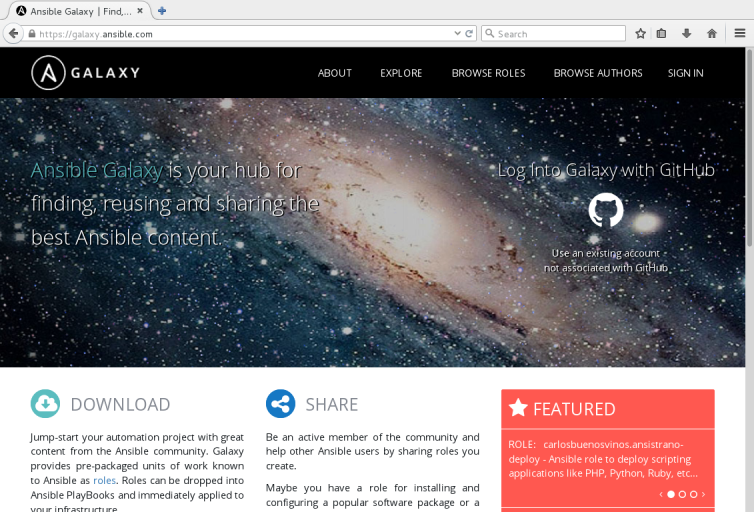
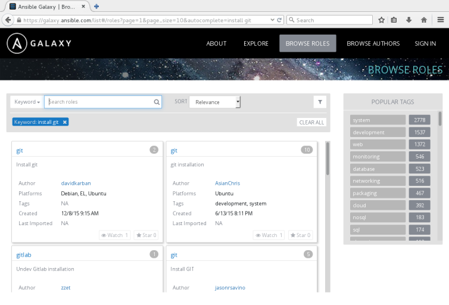

:noaudio:

== Topics

* Roles Overview
* Roles in Playbooks
* Role Creation
* Ansible Galaxy
* `ansible-galaxy`

ifdef::showscript[]

Transcript:

In this module, you learn the following:

* Roles organize Ansible tasks so they can be reused and shared.
* Define role variables in `defaults/main.yml` if they are going to be used as parameters. If not, define them in `vars/main.yml`.
* A role's dependencies can be defined in the `dependencies` section of the role's `meta/main.yml` file.
* Tasks can be applied before and after roles are included by using `pre_tasks` and `post_tasks` in a playbook.
* Ansible Playbooks define roles in the `roles` section.
* Roles defined in playbooks can override default role variables.
* Ansible Galaxy is a public library of Ansible roles written by Ansible users.
* The `ansible-galaxy` command can search for, display information about, install, list, remove, and initialize roles.
* The `ansible-galaxy init --offline` command creates the directory structure for a new role.

endif::showscript[]

== Roles Overview

* Datacenters include variety of host types:
** Web servers
** Database servers
** Hosts containing software development tools

* Playbooks require tasks and handlers to manage these
** Result: large and complex playbooks

* Roles can split playbooks into smaller playbooks and files

ifdef::showscript[]

Transcript:

Datacenters have a variety of different types of hosts. Some hosts serve as web servers, some as database servers, and some as software development servers. An Ansible Playbook containing tasks and handlers to manage all of these cases is likely to become large and complex over time. Ansible roles can help you manage your playbooks more easily by allowing you to split them into separate, smaller playbooks and files.

endif::showscript[]

== Roles Overview

.Role Uses

* Enable Ansible to load components from external files:
** Tasks
** Handlers
** Variables

* Associate and reference:
** Static files
** Templates

* Files defining roles:
** Given specific names
** Organized in directory structure

* Roles written as general purpose can be reused

ifdef::showscript[]

Transcript:

Roles provide Ansible with a way to load tasks, handlers, and variables from external files. Static files and templates can also be associated and referenced by a role. The files that define a role have specific names and are organized in a rigid directory structure. Roles can be written so they are general-purpose and reusable.

endif::showscript[]

== Roles Overview

.Benefits

* Roles promote easy sharing of content
* Roles can define essential elements of a system type:
** Web server
** Database server
** Git repository
** Other purposes
* Roles make larger projects more manageable
* Administrators can work on different project roles in parallel

ifdef::showscript[]

Transcript:

Using Ansible roles offers the following benefits:

* Grouping content by roles allows easy sharing of content with other users.
* You can write roles that define the essential elements of a system type: web server, database server, Git repository, or other purposes.
* Roles make larger projects more manageable.
* Different administrators can work on different roles in a project in parallel.

endif::showscript[]

== Roles Overview

.Structure

* Role functionality defined by directory structure
** Top-level directory: Defines role name
** Some subdirectories: Contain `main.yml` file
** `files` and `templates` subdirectories: Contain objects referenced by `main.yml` files

ifdef::showscript[]

Transcript:

An Ansible role's functionality is defined by its directory structure. The top-level directory defines the name of the role itself. Then come subdirectories that define, among other things, variables, handlers, tasks, templates, and tests. Some of these subdirectories contain their own  `main.yml` file. The `files` and `templates` subdirectories can contain objects referenced by those YAML files.

endif::showscript[]

== Roles Overview

.Structure Example

* `tree` command displays `user.example` directory structure:
+
----
[user@host roles]$ tree user.example
user.example/
├── defaults
│   └── main.yml
├── files
├── handlers
│   └── main.yml
├── meta
│   └── main.yml
├── README.md
├── tasks
│   └── main.yml
├── templates
├── tests
│   ├── inventory
│   └── test.yml
└── vars
└── main.yml
----

ifdef::showscript[]

Transcript:

The `tree` command shown here displays the directory structure of the `user.example` role.

endif::showscript[]

== Roles Overview

.Subdirectories

[cols="1,4",caption=""]
|====
|Subdirectory
|Function
|`defaults`
a|* `main.yml` contains default values for role variables
* Values can be overwritten when role is used
|`files`
|Contains static files referenced by role tasks
|`handlers`
|`main.yml` contains role handler definitions
|`meta`
a|* `main.yml` defines role information
* Includes author, license, platforms, optional dependencies
|`tasks`
|`main.yml` contains role task definitions
|`templates`
|Contains Jinja2 templates referenced by role tasks
|`tests`
a|* Can contain inventory and `test.yml` playbook
* Used to test role
|`vars`
|`main.yml` defines role variable values
|====

ifdef::showscript[]

Transcript:

This table lists the role structure subdirectories.

The `main.yml` file in the `defaults` directory contains the default values of role variables that can be overwritten when the role is used.

The `files` directory contains static files that are referenced by role tasks.

The `main.yml` file in the `handlers` directory contains the role's handler definitions.

The `main.yml` file in the `meta` directory defines information about the role, including author, license, platforms, and optional dependencies.

The `main.yml` file in the `tasks`  directory contains the role's task definitions.

The `templates` directory contains Jinja2 templates that are referenced by role tasks.

The `tests` directory can contain an inventory and `test.yml` playbook that can be used to test the role.

The `main.yml` file in the `vars` directory defines the role's variable values.

endif::showscript[]

== Roles Overview

.Variables and Defaults

* To define role variables, create `vars/main.yml` with name/value pairs in hierarchy
** YAML uses role variables like any other variable: `{{ VAR_NAME }}`
** High priority
** Cannot be overridden by inventory variables

* Use default variables to set default values for included or dependent role variables
** To define default variables, create `defaults/main.yml` with name/value pairs in hierarchy
** Lowest priority of any variables
** Overridden by any other variable

* Best practice: Define variable in `vars/main.yml` _or_ `defaults/main.yml`
* Use default variable when role needs value to be overridden

ifdef::showscript[]

Transcript:

To define role variables, create a `vars/main.yml` file with name/value pairs in the role directory hierarchy. Role variables are used in the role YAML like any other variable: `{{ VAR_NAME }}`. These variables have a high priority and cannot be overridden by inventory variables.

Default variables let you set default values for variables of included or dependent roles. To define default variables, create a `defaults/main.yml` file with name/value pairs in the role directory hierarchy. Default variables have the lowest priority of any variables available. They can be overridden by any other variable, including inventory variables.

It is best practice to define a given variable in either `vars/main.yml` or `defaults/main.yml`, but not both. The `defaults/main.yml` file is the better option if the role needs to override the  value by design.

endif::showscript[]

== Roles in Playbooks

* Simple to use roles in playbooks:
+
----
---
- hosts: remote.example.com
  roles:
    - role1
    - role2
----

ifdef::showscript[]

Transcript:

Using roles in a playbook is simple. The example here shows how to use Ansible roles.

endif::showscript[]

== Roles in Playbooks

.Included Components

* For each role, include the following in playbook in this order:
** Tasks
** Handlers
** Variables
** Dependencies

* Role tasks (`copy`, `script`, `template`, `include`) reference files, templates, tasks
* Ansible searches for items in the following locations:
** Files: `files`
** Templates: `templates`
** Tasks: `tasks`
* Eliminates need for absolute or relative path names

ifdef::showscript[]

Transcript:

For each role specified, the role tasks, role handlers, role variables, and role dependencies are included in the order of roles which appear in the playbook. Any `copy`, `script`, `template`, or `include` tasks in the role can reference the relevant files, templates, or tasks without the need for absolute or relative path names. Ansible looks for these items in the role's `files`, `templates`, or `tasks`, respectively, based on their use.

endif::showscript[]

== Roles in Playbooks

.Alternative Syntax

* `role1` same as previous example
* If `role2` used, default variable values overridden:
+
----
---
- hosts: remote.example.com
  roles:
    - { role: role1 }
    - { role: role2, var1: val1, var2: val2 }
----

ifdef::showscript[]

Transcript:

The example here shows alternate syntax for using a role in a playbook. `role1` is used in the same way as the previous example. Default variable values are overridden when `role2` is used.

endif::showscript[]

== Roles in Playbooks

.Dependencies

* To include roles in playbook based on inclusion of other roles, use dependencies
* Example: Role defining documentation server depends on role that installs and configures web server
* Define roles in `meta/main.yml` in directory hierarchy:
+
----
---
dependencies:
  - { role: apache, port: 8080 }
  - { role: postgres, dbname: serverlist, admin_user: felix }
----

ifdef::showscript[]

Transcript:

Role dependencies allow roles to be included in a playbook based on the inclusion of another role. For example, a role that defines a documentation server may depend on another role that installs and configures a web server. Dependencies are defined in the `meta/main.yml` file in the role directory hierarchy, as shown here.

endif::showscript[]

== Roles in Playbooks

.Dependency Behavior

* Default: Role added as dependency to playbook once
** If role is listed as dependency again, it does not run
* To override default, set `allow_duplicates` to `yes` in `meta/main.yml`

ifdef::showscript[]

Transcript:

A role is added as a dependency to a playbook only once. If the same role is listed as a dependency more than once in the same playbook, it does not run after the first time. To override this behavior, set the `allow_duplicates` variable to `yes` in the `meta/main.yml` file.

endif::showscript[]

== Roles in Playbooks

.Order of Execution

* Default: Role tasks execute before tasks of playbooks in which they appear
* To override default, use `pre_tasks` and `post_tasks`
** `pre_tasks`: Tasks performed before any roles applied
** `post_tasks`: Tasks performed after all roles completed

ifdef::showscript[]

Transcript:

Normally, the tasks of roles execute before the tasks of the playbooks that use the roles. To override this default behavior, Ansible provides `pre_tasks` and `post_tasks` tasks. The `pre_tasks` tasks are performed before any roles are applied. The `post_tasks` tasks are performed after all the roles have completed.

endif::showscript[]

== Roles in Playbooks

.Order of Execution Example

----
---
- hosts: remote.example.com
  pre_tasks:
    - shell: echo 'hello'
  roles:
    - role1
    - role2
  tasks:
    - shell: echo 'still busy'
  post_tasks:
    - shell: echo 'goodbye'
----

ifdef::showscript[]

Transcript:

This example shows the use of `pre_tasks` and `post_tasks` tasks with roles in a playbook.

endif::showscript[]

== Role Creation

* Simple to create roles in Linux
** No special development tools required

* Three-step process:
+
. Create role directory structure
. Define  role content
. Use role in playbook.

ifdef::showscript[]

Transcript:

Creating roles is a simple process in Linux. No special development tools are required. Creating and using a role is a three-step process:

. Create the role directory structure.
. Define the role content.
. Use the role in a playbook.

endif::showscript[]

== Role Creation

.Directory Structure

* Ansible looks for roles in:
** `roles` subdirectory
** Directories referenced by `roles_path`
*** Located in Ansible configuration file
*** Contains list of directories to search

* Each role has directory with specially named subdirectories

ifdef::showscript[]

Transcript:

Ansible looks for roles in a subdirectory called `roles` in the project directory. Roles can also be kept in directories referenced by the `roles_path` variable in the Ansible configuration file. The `roles_path` variable contains a colon-separated list of directories to search.

Each role has its own directory with specially named subdirectories.

endif::showscript[]

== Role Creation

.Directory Structure Example

* Define `motd` role:
+
----
[user@host ~]$ tree roles/
roles/
└── motd
    ├── defaults
    │   └── main.yml
    ├── files
    ├── handlers
    ├── tasks
    │   └── main.yml
    └── templates
        └── motd.j2
----

ifdef::showscript[]

Transcript:

This directory structure contains the files that define the `motd` role.

endif::showscript[]

== Role Creation

.Subdirectories

* `files` and `templates`
** Contain fixed-content files and templates
** Can be deployed by role when it is used
* Other subdirectories
** Contain `main.yml` files
** Define default variable values, handlers, tasks, role metadata, variables
* Empty subdirectory is ignored
* Subdirectory not used by role can be omitted

ifdef::showscript[]

Transcript:

The `files` and `templates` subdirectories contain fixed-content files and templates, respectively, that can be deployed by the role when it is used. The other subdirectories can contain `main.yml` files that define default variable values, handlers, tasks, role metadata, or variables, depending on the subdirectory. If a subdirectory exists but is empty--such as `handlers` in the previous example--the subdirectory is simply ignored. If a role does not use a feature, the subdirectory can be omitted altogether. In the previous example, the `meta` and `vars` subdirectories are omitted because the role does not use them.

endif::showscript[]

== Role Creation

.Content

* After creating structure, define role content
* Use `ROLENAME/tasks/main.yml`
** Defines modules to call on managed hosts where role is applied

ifdef::showscript[]

Transcript:

After you create the directory structure, you must define the content of the Ansible role. A good place to start is the `_ROLENAME_/tasks/main.yml` file. This file defines which modules to call on the managed hosts where this role is applied.

endif::showscript[]

== Role Creation

.Content Example

* `tasks/main.yml` file manages `/etc/motd` on managed hosts
** Uses `template` to copy `motd.j2` to managed host
** Retrieves `motd.j2` from role's `templates` subdirectory:
+
----
[user@host ~]$ cat roles/motd/tasks/main.yml
---
# tasks file for motd

- name: deliver motd file
  template:
    src: templates/motd.j2
    dest: /etc/motd
    owner: root
    group: root
    mode: 0444
----

ifdef::showscript[]

Transcript:

In the example shown here, the `tasks/main.yml` file manages the `/etc/motd` file on managed hosts. It uses the `template` module to copy the template named `motd.j2` to the managed host. The template is retrieved from the `templates` subdirectory of the role.

endif::showscript[]

== Role Creation

.Content Output

* Display contents of `templates/motd.j2` template of `motd` role
** References Ansible facts and `system_owner` variable:
+
----
[user@host ~]$ cat roles/motd/templates/motd.j2
This is the system {{ ansible_hostname }}.

Today's date is: {{ ansible_date_time.date }}.

Only use this system with permission.
You can ask {{ system_owner }} for access.
----

ifdef::showscript[]

Transcript:

In the example here, the command displays the contents of the `templates/motd.j2` template of the `motd` role. It references Ansible facts and a `system_owner` variable.

endif::showscript[]

== Role Creation

.Default Variable Values

* Role can define default value for `system_owner`
** Default values set in `defaults/main.yml` in directory structure

* Example: `defaults/main.yml` sets `system_owner` to `user@host.example.com`
** Email address written in `/etc/motd` of managed hosts where role is applied:
+
----
[user@host ~]$ cat roles/motd/defaults/main.yml
---
system_owner: user@host.example.com
----

ifdef::showscript[]

Transcript:

The role you create can define a default value for the `system_owner` variable. These values are set in the `defaults/main.yml` file in the role's directory structure.

The `defaults/main.yml` file shown here sets the `system_owner` variable to `user@host.example.com`. This is the email address that is written in the `/etc/motd` file of managed hosts to which this role is applied.

endif::showscript[]

== Role Creation

.Use in Playbook

* To access role, reference it in `roles:` playbook section
* Example: Playbook referencing `motd` role
** No variables specified
** Role applied with default variable values:
+
----
[user@host ~]$ cat use-motd-role.yml
---
- name: use motd role playbook
  hosts: remote.example.com
  user: devops
  become: true

  roles:
    - motd
----

ifdef::showscript[]

Transcript:

To access a role, reference it in the `roles:` section of a playbook. The playbook shown here refers to the `motd` role. Because no variables are specified, the role is applied with its default variable values.

endif::showscript[]

== Role Creation

.Playbook Output

* In playbook output, tasks executed due to role identified by role name preceding task
* Example: `deliver motd file` task prefaced by `motd` role name
** Indicates task triggered by role:
+
----
[user@host ~]$ ansible-playbook -i inventory use-motd-role.yml

PLAY [use motd role playbook] **************************************************

TASK [setup] *******************************************************************
ok: [remote.example.com]

TASK [motd : deliver motd file] ************************************************
changed: [remote.example.com]

PLAY RECAP *********************************************************************
remote.example.com : ok=2 changed=1 unreachable=0 failed=0
----

ifdef::showscript[]

Transcript:

When the playbook is executed, you can identify a task whose execution was triggered by a role because the task is preceded by the role name. In this example output, the `deliver motd file` task is prefaced by the `motd` role name, indicating that the task was triggered by the role.

endif::showscript[]

== Role Creation

.Variables

* Use variables with roles to override default values
* When referencing roles with variables, must specify variable/value pairs

ifdef::showscript[]

Transcript:

Similar to using variables as parameters, you can use variables with roles to override previously defined default values. When you reference roles that require variables, you must specify the variable/value pairs.

endif::showscript[]

== Role Creation

.Variable Example

* Use `motd` with different value for `system_owner`
* `someone@host.example.com` replaces variable reference when role is applied to managed host:
+
----
[user@host ~]$ cat use-motd-role.yml
---
- name: use motd role playbook
  hosts: remote.example.com
  user: devops
  become: true

  roles:
    - { role: motd, system_owner: someone@host.example.com }
----

ifdef::showscript[]

Transcript:

The example here shows how to use the `motd` role with a different value for the `system_owner` role variable. The value specified, `someone@host.example.com`, replaces the variable reference when the role is applied to a managed host.

endif::showscript[]

:linkattrs:

== Ansible Galaxy

* link:https://galaxy.ansible.com["https://galaxy.ansible.com^"]
* Library of Ansible roles written by Ansible administrators and users
* Archive contains thousands of Ansible roles
* Database helps users identify helpful roles for accomplishing task
* Includes links to documentation and videos for users and developers

ifdef::showscript[]

Transcript:

Ansible Galaxy, https://galaxy.ansible.com, is a public library of Ansible roles written by  Ansible administrators and users. Its archive contains thousands of Ansible roles. It has a searchable database for identifying roles that might help a user accomplish an administrative task. Ansible Galaxy includes links to documentation and videos for new Ansible users and role developers.

endif::showscript[]

== Ansible Galaxy

.*Home Page*

ifdef::showscript[]

Transcript:

Here is the Ansible Galaxy home page. Note the tabs at the top: *About*, *Explore*, *Browse Roles*, and *Browse Users*.

endif::showscript[]

== Ansible Galaxy

.About Page

* Instructions on how to:
** Use Ansible Galaxy
** Download and use roles from Ansible Galaxy
** Develop and upload roles to Ansible Galaxy

ifdef::showscript[]

Transcript:

The *About* tab on the Ansible Galaxy website home page leads to a page that describes how to use Ansible Galaxy. The page explains how to download and use roles from Ansible Galaxy. It also includes instructions on developing roles and uploading them to Ansible Galaxy.

endif::showscript[]

== Ansible Galaxy

.Explore Page

* Most active, most starred, most watched roles on Ansible Galaxy
* Top role authors and contributors

ifdef::showscript[]

Transcript:

The *Explore* tab on the Ansible Galaxy website home page takes you to a page that shows the most active, the most starred, and the most watched roles on Ansible Galaxy. This page also displays the list of the top role authors and contributors on the site.

endif::showscript[]

== Ansible Galaxy

.Browse Pages

* *Browse Roles* and *Browse Authors*
* Information about roles published on Ansible Galaxy
* Search roles by name or other attributes
* Search role authors by name

ifdef::showscript[]

Transcript:

The *Browse Roles* and *Browse Authors* tabs on the Ansible Galaxy website home page let you access information about the roles published on Ansible Galaxy. You can search for an Ansible role by name or by other attributes. You can also search authors of roles published in Ansible Galaxy by name.

endif::showscript[]

== Ansible Galaxy

.Search Results

* Keyword search on *Browse Roles* page
* Search on term _install git_:
+

ifdef::showscript[]

Transcript:

The following figure shows the search results for a keyword search on the *Browse Roles* page. The term _install git_ was entered into the *Search roles* box.

endif::showscript[]

== Ansible Galaxy

.Search Features

* To perform keyword search, use menu to left of *Search roles* box

[.noredheader,cols="1,3"]
|====
|Search options
a|* Keywords
* Author IDs
* Platform
* Tags
|Platform values
a|* *EL* (Red Hat Enterprise Linux)
* *Fedora*
* *Ubuntu*
|Tag values
a|* *system*
* *development*
* *web*
* *packaging*
* Others
|====

ifdef::showscript[]

Transcript:

The pulldown menu to the left of the *Search roles* box lets you perform searches on keywords, author IDs, platform, and tags. Possible platform values include *EL* for Red Hat Enterprise Linux, *Fedora*, and *Ubuntu*. You can also search on tags, which are often assigned to roles to indicate their use in the datacenter. Possible tag values include *system*, *development*, *web*, *packaging*, and others.

endif::showscript[]

== Ansible Galaxy

.Role Features

[cols="1,3",caption=""]
|====
|Feature
|Description
|Star
a|* Click to vote for usefulness of role
* Number indicates popularity of role
|Watch
a|* Number indicates interest in role under development
|Downloads
a|* Automatically maintained with role
* Number indicates members actually using role
|====

ifdef::showscript[]

Transcript:

Several features are available for each role on the Ansible Galaxy website. Users can vote for the usefulness of a role by clicking the star button. The number of stars a role has is a clue to its popularity among the Ansible community. Users can also watch a role. The number of watchers for a role gives an indication of community interest in a role under development. Finally, the number of times a role is downloaded from Ansible Galaxy is maintained with the role. This count is an indication of how many Ansible users actually use the role.

endif::showscript[]

== `ansible-galaxy`

* Use to perform role tasks:
** Search
** Display information
** Install
** List
** Remove
** Initialize

ifdef::showscript[]

Transcript:

On the Ansible Galaxy site, you can use the `ansible-galaxy` command line tool to search for, display information about, install, list, remove, and initialize roles.

endif::showscript[]

== `ansible-galaxy`

.`search`

* Searches Ansible Galaxy for string specified as argument
* Options to narrow search results:
** `--author`
** `--platforms`
** `--galaxy-tags`

ifdef::showscript[]

Transcript:

The `ansible-galaxy search` subcommand searches Ansible Galaxy for the string specified as an argument. The `--author`, `--platforms`, and `--galaxy-tags` options can be used to narrow the search results.

endif::showscript[]

== `ansible-galaxy`

.`search` Example

* Display roles that
** Include _install_ and _git_ in description
** Are available for Red Hat Enterprise Linux (`el`) platform

[subs="quotes"]
----
[user@host ~]$ ansible-galaxy search 'install git' > --platforms el

Found 77 roles matching your search:

Name 					Description
---- 					-----------
zzet.gitlab 			Undev Gitlab installation
jasonrsavino.git 		Install GIT
samdoran.gitlab 		Install GitLab CE Omnibus
kbrebanov.git 			Installs git
AsianChris.git 			git installation
_... Output omitted ..._
----

ifdef::showscript[]

Transcript:

This example displays the names of roles that include _install_ and _git_ in their description and are available for the Red Hat Enterprise Linux (`el`) platform.

endif::showscript[]

== `ansible-galaxy`

.`info`

* Displays detailed information about role
* If information takes more than one screen, use `less` to scroll

ifdef::showscript[]

Transcript:

The `ansible-galaxy info` subcommand displays more detailed information about a role. The following example displays information about the `davidkarban.git` role available from Ansible Galaxy. If the information takes more than one screen, the `less` command allows you to scroll the information display.

endif::showscript[]

== `ansible-galaxy`

.`info` Example

* `davidkarban.git` role information:
+
----
[user@host ~]$ ansible-galaxy info davidkarban.git
[DEPRECATION WARNING]: The comma separated role spec format, use the
yaml/explicit format instead.. This feature will be removed in a future release.
 Deprecation warnings can be disabled by setting deprecation_warnings=False in
ansible.cfg.
less 458 (POSIX regular expressions)
Copyright (C) 1984-2012 Mark Nudelman

less comes with NO WARRANTY, to the extent permitted by law.
For information about the terms of redistribution,
see the file named README in the less distribution.
Homepage: http://www.greenwoodsoftware.com/less

Role: davidkarban.git
        description: Install git
        active: True
        commit:
        commit_message:
        commit_url:
        company: David Karban
        created: 2015-12-08T09:15:48.542Z
        download_count: 1
        forks_count: 0
        github_branch:
        github_repo: ansible-git
        github_user: davidkarban
        id: 6422
        is_valid: True
        issue_tracker_url: https://github.com/davidkarban/ansible-git/issues
        license: license (GPLv2, CC-BY, etc)
        min_ansible_version: 1.2
        modified: 2016-04-20T20:13:35.549Z
        namespace: davidkarban
        open_issues_count: 0
        path: /etc/ansible/roles
:
----

ifdef::showscript[]

Transcript:

This example displays information about the `davidkarban.git` role available from Ansible Galaxy.

endif::showscript[]

== `ansible-galaxy`

.`install`

* Downloads role from Ansible Galaxy
* Installs locally on control node
** Default installation location: `/etc/ansible/roles`
* To override default:
** Set `role_path` configuration variable value
** Use `-p _DIRECTORY_` option on command line

ifdef::showscript[]

Transcript:

The `ansible-galaxy install` subcommand downloads a role from Ansible Galaxy, then installs it locally on the control node. The default installation location for roles is `/etc/ansible/roles`. To override this location, either set the value of the `role_path` configuration variable or use the `-p _DIRECTORY_` option on the command line.

endif::showscript[]

== `ansible-galaxy`

.`install` Example

----
[user@host ~]$ ansible-galaxy install davidkarban.git -p roles/
- downloading role 'git', owned by davidkarban
- downloading role from https://github.com/davidkarban/ansible-git/archive/master.tar.gz
- extracting davidkarban.git to roles/davidkarban.git
- davidkarban.git was installed successfully
[user@host ~]$ ls roles/
davidkarban.git
----

ifdef::showscript[]

Transcript:

This example uses the `-p` option to override the default installation directory.

endif::showscript[]

== `ansible-galaxy`

.`install -r`

* To install multiple roles with single `ansible-galaxy install` command, use `-r`
** Specifies resource file
** YAML file that specifies roles to download and install
* To determine what role is called locally, use `name`

ifdef::showscript[]

Transcript:

To install multiple roles with a single `ansible-galaxy install` command, use the `-r` option to specify a resource file. The resource file is a YAML file that specifies which roles to download and install. To determine what the role is called locally, use a `name` value.

endif::showscript[]

== `ansible-galaxy`

.Role Sources

* Can specify many types of role sources in resource file
* Example:
** Specify one download from Ansible Galaxy
** Specify second download from different web server:
+
----
[user@host ~]$ cat roles2install.yml
# From Galaxy
- src: author.rolename

# From a webserver, where the role is packaged in a gzipped tar archive
- src: https://webserver.example.com/files/sample.tgz
  name: ftpserver-role
[user@host ~]$ ansible-galaxy install -r roles2install.yml
----

ifdef::showscript[]

Transcript:

You can specify many types of role sources in a resource file. This example shows how to specify one download from Ansible Galaxy and a second download from another web server.

endif::showscript[]

== Ansible Galaxy

.Use in Playbooks

* Use roles from Ansible Galaxy like any other role in playbooks
* Referenced in `roles:` using `_AUTHOR.NAME_`
* Example: `use-git-role.yml` playbook references `davidkarban.git` role:
+
----
[user@host ~]$ cat use-git-role.yml
---
- name: use davidkarban.git role playbook
  hosts: remote.example.com
  user: devops
  become: true

  roles:
    - davidkarban.git
----

ifdef::showscript[]

Transcript:

Roles downloaded and installed from Ansible Galaxy can be used in playbooks like any other role. They are referenced in the `roles:` section using their full `_AUTHOR.NAME_` role name. The `use-git-role.yml` playbook shown here references the `davidkarban.git` role.

endif::showscript[]

== Ansible Galaxy

.Playbook Output

* Example: Install `git` on `remote.example.com`
* Output displays role name including author as tasks execute
+
----
[user@host ~]$ ssh remote.example.com rpm -q git
package git is not installed
[user@host ~]$ ansible-playbook use-git-role.yml

PLAY [use davidkarban.git role playbook] ***************************************

TASK [setup] *******************************************************************
ok: [remote.example.com]

TASK [davidkarban.git : Load the OS specific variables] ************************
ok: [remote.example.com]

TASK [davidkarban.git : Install the packages in Redhat derivates] **************
[DEPRECATION WARNING]: Using bare variables is deprecated. Update your playbooks
so that the environment value uses the full variable syntax ('{{git_pkgs}}').
This feature will be removed in a future release. Deprecation warnings can be
disabled by setting deprecation_warnings=False in ansible.cfg.
changed: [remote.example.com] => (item=[u'git'])

... Output omitted ...

PLAY RECAP *********************************************************************
remote.example.com : ok=3 changed=1 unreachable=0 failed=0

[user@host ~]$ ssh remote.example.com rpm -q git
git-1.8.3.1-5.el7.x86_64
----

ifdef::showscript[]

Transcript:

Using the playbook shown here installs `git` on the `remote.example.com` server. The full role name, including the author, is displayed as its tasks are executed by the playbook.

endif::showscript[]

== `ansible-galaxy`

.Managing Local Roles

* To list local roles, use `ansible-galaxy list`
* To remove a local role, use `ansible-galaxy remove`
+
----
[user@host ~]$ ansible-galaxy list
- davidkarban.git, master
- student.bash_env, (unknown version)
[user@host ~]$ ansible-galaxy remove student.bash_env
- successfully removed student.bash_env
[user@host ~]$ ansible-galaxy list
- davidkarban.git, master
----

ifdef::showscript[]

Transcript:

The `ansible-galaxy` command can manage local roles. The `ansible-galaxy list` subcommand lists the roles that are found locally. A role can be removed locally with the `ansible-galaxy remove` subcommand. This example shows use of both commands.

endif::showscript[]

== `ansible-galaxy`

.`init`

* Creates directory structure in current directory
** Use for new role to be developed
** Role author and name specified as argument
* To use command when Internet is unavailable, use `--offline`:
+
----
[user@host roles]$ ansible-galaxy init --offline student.example
- student.example was created successfully
[user@host roles]$ ls student.example/
defaults files handlers meta README.md tasks templates tests vars
----

ifdef::showscript[]

Transcript:

The `ansible-galaxy init` command creates a directory structure in the current directory for a new role that is to be developed. The author and name of the role are specified as an argument to the command. The `--offline` option lets you use this command when Internet access is unavailable, as shown here.

endif::showscript[]

== Summary

* Roles Overview
* Roles in Playbooks
* Role Creation
* Ansible Galaxy
* `ansible-galaxy`

ifdef::showscript[]

Transcript:

In this module, you learned the following:

* Roles organize Ansible tasks so they can be reused and shared.
* Define role variables in `defaults/main.yml` if they are going to be used as parameters. If not, define them in `vars/main.yml`.
* A role's dependencies can be defined in the `dependencies` section of the role's `meta/main.yml` file.
* Tasks can be applied before and after roles are included by using `pre_tasks` and `post_tasks` in a playbook.
* Ansible Playbooks define roles in the `roles` section.
* Roles defined in playbooks can override default role variables.
* Ansible Galaxy is a public library of Ansible roles written by Ansible users.
* The `ansible-galaxy` command can search for, display information about, install, list, remove, and initialize roles.
* The `ansible-galaxy init --offline` command creates the directory structure for a new role.

endif::showscript[]
